# Memoria técnica de QuantTrack

## 1. Propósito de la aplicación

`QuantTrack` es una app Android orientada al análisis cuantitativo básico de mercado. No intenta ser una plataforma de trading ni un sistema de ejecución. Su papel es otro: descargar datos, transformarlos en métricas financieras entendibles y enseñarlos de una forma visual.

La app está pensada alrededor de cuatro preguntas:

1. ¿Qué tendencia tiene una acción y con qué fuerza se mueve?
2. ¿Qué está diciendo la curva de tipos sobre el estado del mercado?
3. ¿Qué riesgo tiene una cartera concreta?
4. ¿Qué volatilidad y qué liquidez tiene un activo frente al mercado?

Además, la app incorpora dos apoyos que son importantes:

1. Una biblioteca o glosario interno con términos financieros y matemáticos.
2. Una llamada a Gemini para que la propia pantalla se pueda interpretar en lenguaje natural a partir de los datos que ya están cargados.

### Esquema general de la app

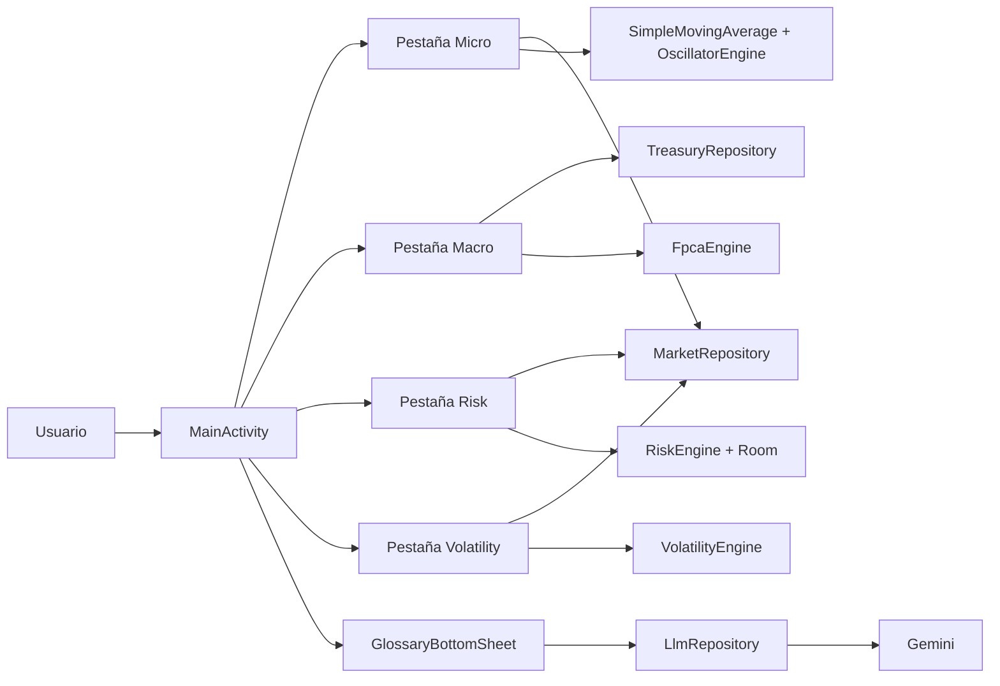

### Qué aporta cada módulo

| Módulo | Qué analiza | Qué devuelve |
|---|---|---|
| `Micro` | Precio de una acción, tendencia y momentum | Velas, SMA 20/50/200, RSI y lectura rápida |
| `Macro` | Curva de tipos del Tesoro de EE.UU. | Curva actual, spread 10Y-2Y y factores principales |
| `Risk` | Cartera de varios activos | Notional, volatilidad, VaR, CVaR, pesos y correlaciones |
| `Volatility` | Riesgo y liquidez de un activo | Beta, percentil de volatilidad, ATR y RVOL |
| `Gemini + Biblioteca` | Explicación contextual | Un resumen en lenguaje natural de la pantalla actual |

### Imagen 

>Captura de la pantalla principal con las cuatro pestañas y el botón flotante.


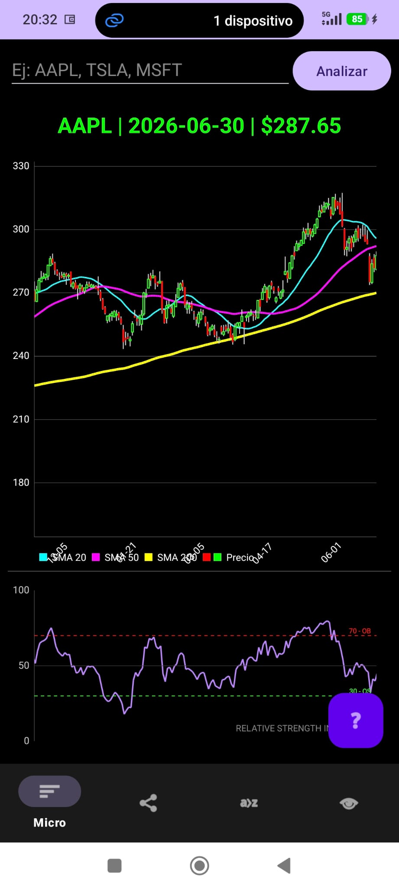


## 2. Dependencias utilizadas

La aplicación se apoya en las siguientes librerías:

| Dependencia | Papel dentro de la app | Dónde se usa |
|---|---|---|
| `androidx.appcompat:appcompat` | Base de compatibilidad Android | Estructura general de la app |
| `com.google.android.material:material` | Componentes visuales de Material Design | `BottomNavigationView`, `FloatingActionButton`, `BottomSheetDialogFragment` |
| `androidx.constraintlayout:constraintlayout` | Soporte de layouts | Está instalada, aunque en esta versión predominan `LinearLayout` y `RelativeLayout` |
| `com.squareup.retrofit2:retrofit` | Cliente HTTP declarativo | Descarga de Yahoo Finance y llamada a Gemini |
| `com.squareup.retrofit2:converter-gson` | Conversión JSON a objetos | Respuesta de Gemini |
| `com.squareup.retrofit2:converter-scalars` | Respuesta cruda como `String` | Yahoo Finance, para parsear el JSON manualmente |
| `com.squareup.okhttp3:logging-interceptor` | Inspección de tráfico HTTP | Dependencia preparada; la app usa además `OkHttpClient` con cabeceras personalizadas |
| `com.github.PhilJay:MPAndroidChart` | Gráficos financieros y estadísticos | Velas, líneas, pastel y gráficos combinados |
| `org.apache.commons:commons-math3` | Álgebra lineal y covarianzas | `FpcaEngine` y `RiskEngine` |
| `androidx.room:room-runtime` | Persistencia local sobre SQLite | Cartera del módulo de riesgo |
| `androidx.room:room-compiler` | Generación de código para Room | DAO y tabla persistente |

También hay un detalle básico pero necesario: en `AndroidManifest.xml` se declara el permiso `INTERNET`, sin el cual ninguna descarga de datos funcionaría.

### Imagen 

> Imagen: diagrama-resumen de librerías y responsabilidades.

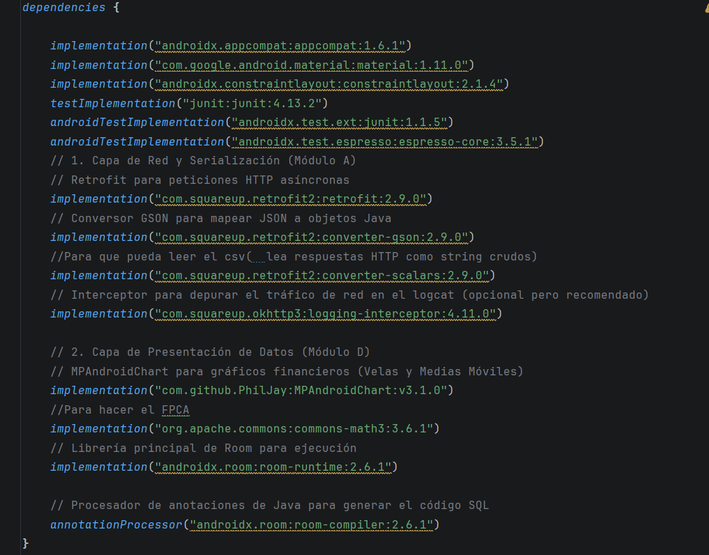


## 3. Arquitectura real del proyecto

La aplicación tiene una arquitectura por capas :

1. Una capa de interfaz hecha con `MainActivity`, `Fragment` y XML.
2. Una capa de datos con repositorios que hablan con servicios externos.
3. Una capa matemática separada del framework Android.
4. Una pequeña capa de persistencia local con Room para la cartera.

### Esquema por capas

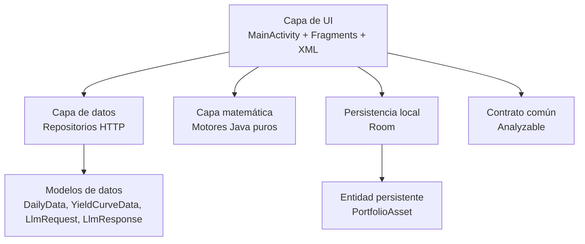

### Piezas principales de la arquitectura

| Pieza | Responsabilidad |
|---|---|
| `MainActivity` | Orquesta la navegación entre pestañas y centraliza la llamada a Gemini |
| `Fragment` | Cada pestaña concentra la lógica visual de un dominio concreto |
| `MarketRepository` | Descarga precios históricos de Yahoo Finance |
| `TreasuryRepository` | Descarga la curva de tipos del Tesoro de EE.UU. |
| `LlmRepository` | Envía el prompt contextual a Gemini |
| `domain/math/*` | Implementa cálculos puros, sin depender de Android |
| `AppDatabase`, `PortfolioDao`, `PortfolioAsset` | Guardan la cartera entre sesiones |
| `Analyzable` | Hace que una pestaña pueda generar un prompt para la IA |

### Flujo general de una pantalla

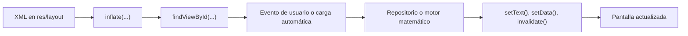

Los cálculos importantes están aislados en clases Java puras. Eso hace que la matemática sea más fácil de revisar, de probar y de explicar.

## 4. MainActivity, navegación común y llamada a Gemini

`MainActivity` es el punto de entrada de la app. No hace cálculos financieros. Su misión es coordinar.

Hace tres cosas esenciales:

1. Monta la pantalla principal.
2. Cambia de pestaña cuando el usuario toca la barra inferior.
3. Lanza el flujo común de biblioteca + Gemini desde el botón flotante.

### Estructura de `activity_main.xml`

El layout principal está definido como un `RelativeLayout` negro con tres bloques:

1. Un `FragmentContainerView` que ocupa casi toda la pantalla.
2. Un `BottomNavigationView` anclado abajo.
3. Un `FloatingActionButton` que flota por encima y sirve para abrir la biblioteca y, desde ahí, disparar la IA.

### Esquema del layout principal

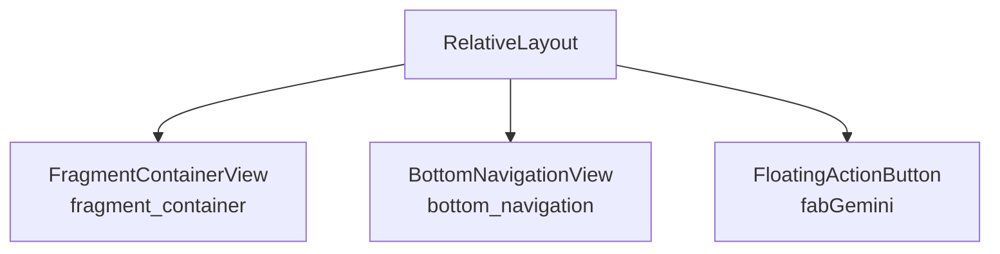

### Cómo se unen las pestañas

En `onCreate`, `MainActivity` escucha la selección del `BottomNavigationView`. Según el `itemId`, crea uno de estos fragmentos:

1. `MicroFragment`
2. `MacroFragment`
3. `RiskFragment`
4. `VolatilityFragment`

Después reemplaza el contenido del contenedor con `getSupportFragmentManager().beginTransaction().replace(...).commit()`.

Dicho de forma simple: la actividad es siempre la misma, y lo que cambia es el fragmento que se inserta dentro de ella.

### Esquema de navegación

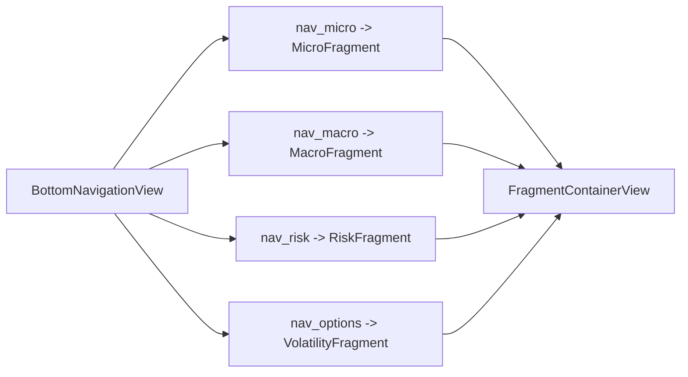

Además, si la actividad arranca por primera vez, se fuerza la pestaña `Micro` como vista por defecto.

### El menú inferior

El archivo `bottom_nav_menu.xml` define cuatro entradas:

1. `Micro`
2. `Macro (Tipos)`
3. `Riesgo`
4. `Volatilidad`

Esto es importante porque la navegación no está "dibujada" en Java, sino declarada en XML y luego enlazada en la actividad.

### Flujo completo del botón de Gemini

El botón flotante no llama a Gemini de forma directa. Antes pasa por la biblioteca y por un pequeño filtro lógico.

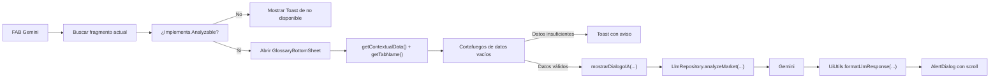

### Qué hace `Analyzable`

La interfaz `Analyzable` tiene dos métodos:

1. `getTabName()`
2. `getContextualData()`

Eso crea un contrato muy útil: cualquier pestaña que implemente esa interfaz puede decirle a `MainActivity` cómo debe llamarse en pantalla y qué datos necesita Gemini para analizarla.

### Cómo se llama a Gemini

La llamada se encapsula en `LlmRepository`. El flujo es este:

1. Se construye un `LlmRequest` con el prompt textual.
2. `LlmApi` hace un `POST` al endpoint `generateContent`.
3. La respuesta JSON llega como `LlmResponse`.
4. `getAnswer()` extrae el primer texto útil.
5. La UI actualiza el `AlertDialog` con el resultado.

El popup se abre antes de que llegue la respuesta. Así el usuario ve un estado de carga y entiende que la app está trabajando.

### El papel de `UiUtils`

`UiUtils.formatLlmResponse(...)` es pequeño, pero hace una función importante: limpia el texto generado por el modelo para que se vea bien en Android.

Concretamente:

1. Convierte `**texto**` en negrita HTML.
2. Convierte `*texto*` en cursiva HTML.
3. Respeta los saltos de línea sustituyéndolos por `<br>`.
4. Devuelve un `Spanned` usando `Html.fromHtml(...)`.

En otras palabras, actúa como una capa mínima de presentación. Sin ella, la respuesta del modelo saldría como texto plano y quedaría mucho peor.

## 5. Pestaña Micro: tendencia y momentum de una acción

La pestaña `Micro` es la más directa de entender. El usuario escribe un ticker, la app descarga el histórico diario y enseguida construye dos lecturas:

1. La tendencia, mediante velas y medias móviles.
2. La fuerza del movimiento, mediante RSI.

### Qué busca esta pestaña

La lógica aquí es sencilla:

1. Ver dónde está el precio.
2. Compararlo con medias de corto, medio y largo plazo.
3. Medir si la subida o la bajada tiene fuerza real.

Eso la convierte en una pestaña muy útil como primera foto de un activo.

### Flujo completo de datos en Micro

Aquí conviene explicar bien la descarga, porque este patrón se reutiliza luego en `Risk` y `Volatility`. Así evitamos repetirlo más tarde.

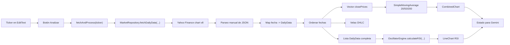

### Cómo se descargan los datos de mercado

`MarketRepository` usa `Retrofit` y `OkHttpClient` para llamar al endpoint:

```text
https://query2.finance.yahoo.com/v8/finance/chart/{ticker}
```

Los parámetros que se envían son:

1. `interval = 1d`
2. `range = 2y`

El cliente añade cabeceras como `User-Agent` y `Accept` para que Yahoo no rechace la petición con demasiada facilidad. Eso no deja de ser una solución práctica. No es una API empresarial cerrada con contrato fuerte.

La respuesta se parsea manualmente. De cada día se extraen:

1. `open`
2. `high`
3. `low`
4. `close`
5. `volume`

Cada fila diaria se guarda en un objeto `DailyData`.

### Modelo matemático de los datos

Para cada fecha \( t \), el objeto `DailyData` representa:

$$
X_t = (O_t, H_t, L_t, C_t, V_t)
$$

donde:

1. $O_t$ es el precio de apertura.
2. $H_t$ es el máximo.
3. $L_t$ es el mínimo.
4. $C_t$ es el cierre.
5. $V_t$ es el volumen.

La pestaña `Micro` usa sobre todo la serie de cierres \( \{C_t\} \), aunque conserva `high` y `low` para dibujar las velas.

### Media móvil simple (SMA)

La clase `SimpleMovingAverage` implementa una media móvil simple de periodo \( n \):

$$
\text{SMA}_t^{(n)} = \frac{1}{n}\sum_{k=0}^{n-1} C_{t-k}
$$

En la app se usan tres periodos:

1. $n = 20$
2. $n = 50$
3. $n = 200$

Estas tres medias responden a horizontes distintos:

1. La SMA 20 capta el pulso corto.
2. La SMA 50 suaviza bastante más.
3. La SMA 200 da una idea de estructura de fondo.

#### Implementación eficiente

El algoritmo no recalcula la suma completa para cada ventana. Usa una ventana deslizante:

$$
S_t = S_{t-1} + C_t - C_{t-n}
$$

y entonces:

$$
\text{SMA}_t^{(n)} = \frac{S_t}{n}
$$

Eso reduce la complejidad a $O(N)$, que es lo correcto para series largas.

### RSI con suavizado de Wilder

El RSI se calcula en `OscillatorEngine` con periodo $n = 14$. La idea es medir la fuerza relativa entre cierres alcistas y bajistas.

Primero se define el cambio diario:

$$
\Delta_t = C_t - C_{t-1}
$$

Después se separan ganancias y pérdidas:

$$
G_t = \max(\Delta_t, 0)
$$

$$
L_t = \max(-\Delta_t, 0)
$$

La media inicial se calcula de forma simple:

$$
\overline{G}_{n} = \frac{1}{n}\sum_{t=1}^{n} G_t
\qquad
\overline{L}_{n} = \frac{1}{n}\sum_{t=1}^{n} L_t
$$

Para el resto de sesiones, el código aplica el suavizado de Wilder:

$$
\overline{G}_{t} = \frac{(n-1)\overline{G}_{t-1} + G_t}{n}
$$

$$
\overline{L}_{t} = \frac{(n-1)\overline{L}_{t-1} + L_t}{n}
$$

Con eso se construye la fuerza relativa:

$$
RS_t = \frac{\overline{G}_t}{\overline{L}_t}
$$

y finalmente:

$$
RSI_t = 100 - \frac{100}{1 + RS_t}
$$

Si $\overline{L}_t = 0$, el código devuelve \( 100 \), que representa una secuencia sin pérdidas en esa fase del cálculo.

### Cómo lo implementa `MicroFragment`

`MicroFragment` hace el trabajo de pegar piezas:

1. Infla `fragment_micro.xml`.
2. Enlaza el `EditText`, el botón, el precio y los dos gráficos.
3. Configura estética del `CombinedChart` y del gráfico RSI.
4. Llama a `fetchAndProcess("AAPL")` por defecto al abrir.
5. Cuando llegan los datos, ordena fechas, crea velas, calcula SMA y RSI, y lo dibuja todo.

Además, guarda varios escalares de estado:

1. `currentTicker`
2. `currentPrice`
3. `currentSma20`
4. `currentSma50`
5. `currentSma200`
6. `currentRsi`

Eso luego se usa para construir el prompt de Gemini.

### Cómo se lee la visualización

La pantalla tiene dos niveles:

1. Arriba, un `CombinedChart` con velas y medias móviles superpuestas.
2. Abajo, un `LineChart` con el RSI.

El gráfico RSI añade tres referencias visuales:

1. Línea de sobrecompra en 70.
2. Línea de sobreventa en 30.
3. Línea neutra en 50.

La vista queda bastante intuitiva. Un vistazo suele bastar para saber si el precio está por encima o por debajo de sus medias y si el impulso acompaña o no.

### Estructura de `fragment_micro.xml`

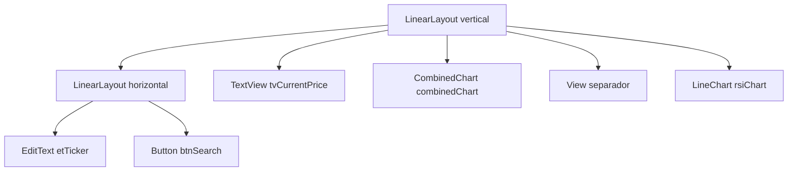

El layout reparte el alto con `layout_weight`:

1. El gráfico principal recibe más espacio.
2. El RSI queda abajo, más pequeño, como panel auxiliar.

Eso está bien resuelto, porque el RSI es importante, pero no debe competir visualmente con la serie principal.

### Imagen 

> Imagen: captura de la pestaña Micro con una acción cargada.


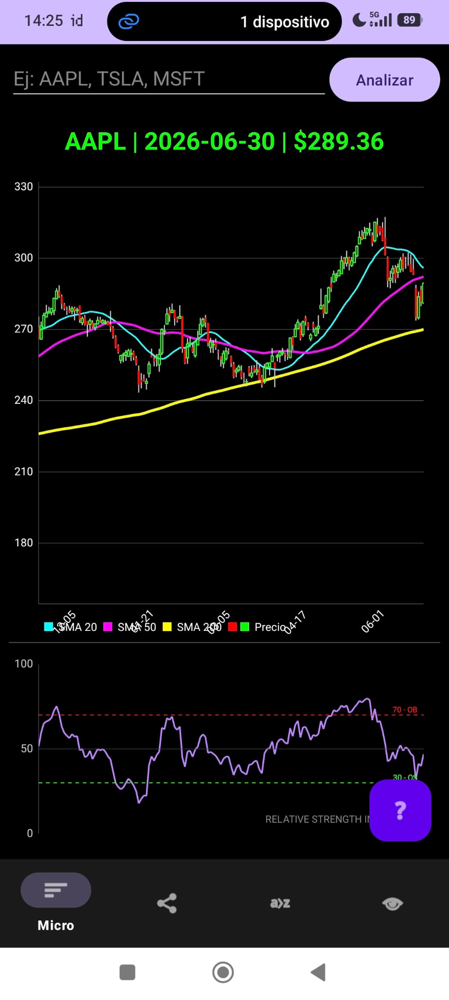


## 6. Pestaña Macro: curva de tipos, spread y PCA sobre vencimientos

La pestaña `Macro` cambia de escala. Ya no mira una acción concreta, sino una foto del mercado de renta fija pública estadounidense.

Aquí la idea es simple, pero potente:

1. Descargar la curva de tipos del Tesoro.
2. Ver su forma actual.
3. Resumir su dinámica histórica en unos pocos factores.

### Qué es una tasa de interés en este contexto

En esta pestaña, una tasa de interés es el rendimiento asociado a bonos del Tesoro de distintas maturities o vencimientos. Cada punto de la curva representa un plazo distinto:

1. 1 mes
2. 3 meses
3. 6 meses
4. 1 año
5. 2 años
6. 3 años
7. 5 años
8. 7 años
9. 10 años
10. 20 años
11. 30 años

La relación entre todos esos puntos forma la curva de tipos. Esa curva importa porque resume expectativas sobre inflación, política monetaria y ciclo económico.

### Qué nos dice la curva

En términos muy prácticos:

1. Si la curva está inclinada hacia arriba, el mercado suele exigir más rentabilidad por prestar a más plazo.
2. Si la curva se aplana, el mercado está más dudoso.
3. Si la curva se invierte, sobre todo en el spread 10Y-2Y, suele interpretarse como una señal seria de tensión macroeconómica.

### Flujo de datos en Macro

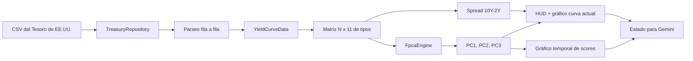

### Fuente de datos

`TreasuryRepository` llama a un CSV público del Tesoro. No usa JSON. Descarga el fichero entero y lo recorre línea a línea.

Eso da una ventaja práctica: el formato es simple y transparente. A cambio, el código queda más manual.

Cada fila se convierte en un `YieldCurveData`, con once vencimientos seleccionados.

### Construcción del vector de curva

Para cada fecha \( t \), la curva se representa como un vector:

$$
y_t =
\begin{bmatrix}
y_{1M,t} & y_{3M,t} & y_{6M,t} & y_{1Y,t} & y_{2Y,t} & y_{3Y,t} & y_{5Y,t} & y_{7Y,t} & y_{10Y,t} & y_{20Y,t} & y_{30Y,t}
\end{bmatrix}^{\top}
$$

La app utiliza una matriz histórica:

$$
Y \in \mathbb{R}^{N \times 11}
$$

donde:

1. \( N \) es el número de días históricos.
2. Cada fila es una curva completa.
3. Cada columna es un vencimiento fijo.

### Spread 10Y-2Y

La métrica inmediata que muestra la pestaña es:

$$
\text{Spread}_{10Y-2Y}(t) = y_{10Y,t} - y_{2Y,t}
$$

Como los rendimientos están expresados en puntos porcentuales, al multiplicar por 100 el resultado se enseña en puntos básicos:

$$
1 \text{ punto porcentual} = 100 \text{ bps}
$$

Si el spread es negativo, la app lo pinta en rojo. Esa decisión visual está muy bien elegida: reduce el tiempo de lectura.

Hacemos un PCA.


### Paso 1: centrado por la media

Se calcula la media por vencimiento:

$$
\bar{y}_j = \frac{1}{N}\sum_{t=1}^{N} y_{t,j}
$$

Después se centra la matriz:

$$
X_{t,j} = y_{t,j} - \bar{y}_j
$$

o, de forma compacta:

$$
X = Y - \mathbf{1}\bar{y}^{\top}
$$

### Paso 2: matriz de covarianza

Con los datos centrados se construye la covarianza empírica:

$$
\Sigma = \frac{1}{N-1} X^{\top}X
$$

Aquí:

1. $\Sigma \in \mathbb{R}^{11 \times 11}$
2. cada entrada mide cómo co-varían dos vencimientos a lo largo del tiempo

### Paso 3: descomposición espectral

El motor calcula autovalores y autovectores:

$$
\Sigma v_k = \lambda_k v_k
$$

donde:

1. $\lambda_k$ es la varianza explicada por el componente $k$
2. $v_k$ es la dirección principal asociada

### Paso 4: scores temporales

Los scores temporales se obtienen proyectando cada curva centrada sobre los autovectores:

$$
z_{t,k} = X_t^{\top} v_k
$$

o matricialmente:

$$
Z = XV
$$

La app usa sobre todo los tres primeros componentes, porque son los que suelen concentrar la gran mayoría de la varianza.

### Varianza explicada

Cada porcentaje de varianza explicada se calcula como:

$$
\text{VarExp}_k = 100 \cdot \frac{\lambda_k}{\sum_{j=1}^{11}\lambda_j}
$$

La lectura económica típica es:

1. `PC1`: nivel
2. `PC2`: pendiente
3. `PC3`: curvatura

Eso resume la teoría clásica de descomposición de la curva:

1. subir o bajar toda la curva a la vez,
2. inclinarla,
3. cambiar su joroba central.

### Qué hace `MacroFragment`

`MacroFragment` une la teoría con la visualización:

1. Descarga el histórico del Tesoro.
2. Toma la curva más reciente para dibujar la forma actual.
3. Calcula el spread 10Y-2Y.
4. Construye la matriz histórica \( N \times 11 \).
5. Llama a `FpcaEngine`.
6. Muestra la varianza explicada y los scores temporales.
7. Guarda `currentDate`, `currentSpread`, `varPc1`, `varPc2`, `varPc3`, `lastPc1` y `lastPc2` para Gemini.

### Cómo ayuda esto a entender el mercado

Esta pestaña es útil porque evita mirar once series aisladas.

En lugar de eso:

1. enseña la curva actual como una forma,
2. resume su dinámica en factores,
3. y permite leer mejor el régimen macro.

Si `PC1` domina, el movimiento es más de nivel general de tipos. Si `PC2` se vuelve muy negativo, la señal es de pendiente rara o invertida. Si `PC3` gana relevancia, la parte media de la curva se está moviendo distinto de los extremos.

### Estructura de `fragment_macro.xml`

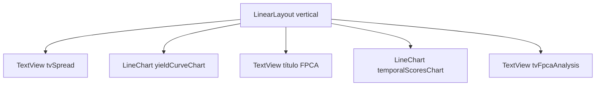

Es un layout muy limpio. Tiene lógica de lectura vertical:

1. arriba el dato rápido,
2. en medio la curva,
3. debajo la evolución temporal de factores,
4. al final un resumen textual.

### Imagen 

> Imagen : captura de la pestaña Macro con la curva y el panel de FPCA.


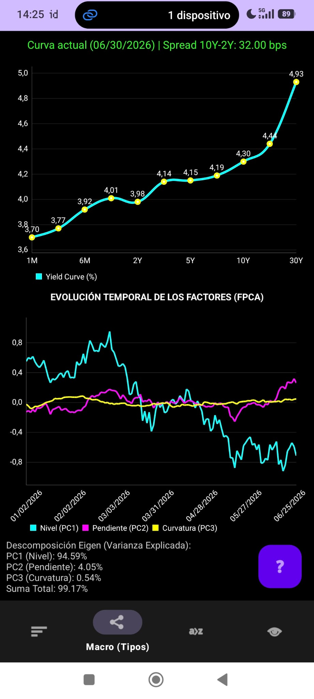


## 7. Pestaña Risk: cartera, covarianza, VaR, CVaR y persistencia con Room

La pestaña `Risk` es la más rica en estructura interna. No analiza un activo suelto, sino una cartera con varios componentes.

Aquí aparecen tres ideas a la vez:

1. persistencia local de la cartera,
2. construcción de pesos y retornos,
3. medición del riesgo agregado.

### Idea funcional de la pestaña

El usuario añade pares `ticker + número de acciones`. Después la app:

1. valida que el ticker exista,
2. lo guarda en memoria y en disco,
3. descarga históricos de todos los activos,
4. alinea fechas,
5. calcula riesgo conjunto,
6. y lo representa con números y gráficos.

### Esquema general de la pestaña Risk

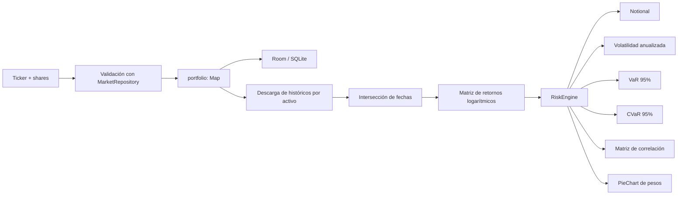

### Persistencia local con Room

Aquí conviene aclarar un punto: la app usa **Room**. Room es la librería de persistencia de Android sobre SQLite.

Las tres piezas son:

1. `PortfolioAsset`: entidad persistente.
2. `PortfolioDao`: operaciones de lectura y escritura.
3. `AppDatabase`: singleton que crea la base de datos local.

### Esquema de Room

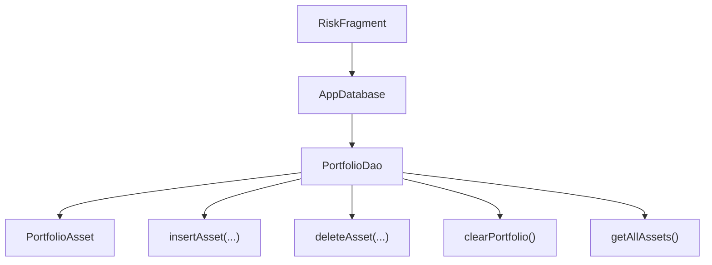

`PortfolioAsset` tiene:

1. `ticker` como clave primaria,
2. `shares` como cantidad almacenada.

La estrategia `OnConflictStrategy.REPLACE` hace algo muy útil: si el usuario vuelve a meter un ticker existente, la fila se sobrescribe con el número actualizado de acciones.

### Cómo se evita perder la cartera entre sesiones

Nada más arrancar `RiskFragment`, se llama a:

1. `AppDatabase.getDatabase(getContext())`
2. `cargarCarteraDesdeDisco()`

La lectura se hace con un `ExecutorService` de un solo hilo (`diskExecutor`) para no bloquear la UI. Luego los datos se vuelcan al `Map<String, Double> portfolio` en el hilo principal y se repinta la pantalla.

Eso significa que la cartera no desaparece al cerrar la app. Se restaura sola cuando el fragmento vuelve a abrirse.

### Validación previa de cada activo

Cuando se añade un activo:

1. se bloquea visualmente el botón,
2. se prueba el ticker contra Yahoo Finance,
3. si la respuesta es válida, se actualiza RAM y luego Room,
4. si falla, no se guarda nada y se muestra un `Toast`.

 Evita contaminar la base de datos con tickers erróneos.

### Construcción del notional

Supongamos una cartera con  $m$  activos. Si $q_i$ es el número de acciones del activo $i$ y $P_i$ es su precio actual, el notional total es:

$$
N = \sum_{i=1}^{m} q_i P_i
$$

Ese escalar es el tamaño monetario actual de la cartera.

### Construcción de los pesos

Los pesos se calculan como participación de mercado actual:

$$
w_i = \frac{q_i P_i}{N}
$$

Por construcción:

$$
\sum_{i=1}^{m} w_i = 1
$$

Esto es importante. La app no usa pesos arbitrarios escritos a mano. Los deduce a partir de las posiciones y del último precio disponible.

### Alineación temporal y matriz de retornos

No se puede calcular bien una covarianza si los activos no están alineados en fechas comunes.

Por eso `RiskFragment`:

1. toma la intersección de fechas de todos los activos,
2. ordena esas fechas,
3. y solo con ellas construye la matriz de retornos.

Para cada activo $i$ y para cada fecha $t$, el retorno logarítmico es:

$$
r_{t,i} = \ln\left(\frac{P_{t,i}}{P_{t-1,i}}\right)
$$

Con eso se obtiene una matriz:

$$
R \in \mathbb{R}^{T \times m}
$$

donde:

1. $T$ es el número de retornos disponibles,
2. $m$ es el número de activos.

### Matriz de covarianza

`RiskEngine` construye la covarianza empírica:

$$
\Sigma = \text{Cov}(R)
$$

Esta matriz resume cómo varían los retornos de forma conjunta.

### Varianza y volatilidad de cartera

La varianza paramétrica de la cartera se calcula como:

$$
\sigma_p^2 = w^{\top}\Sigma w
$$

La volatilidad diaria es:

$$
\sigma_{p,d} = \sqrt{w^{\top}\Sigma w}
$$

Y la volatilidad anualizada:

$$
\sigma_{p,a} = \sigma_{p,d}\sqrt{252}
$$

El factor $\sqrt{252}$ responde a la convención de 252 sesiones bursátiles anuales.

### VaR paramétrico al 95%

La app usa un VaR paramétrico normal al 95%, con:

$$
z_{0.95} = 1.645
$$

Entonces:

$$
\text{VaR}_{95} = N \cdot z_{0.95} \cdot \sigma_{p,d}
$$

Interpretación: es una pérdida monetaria diaria que solo debería superarse aproximadamente en el 5% peor de los casos, bajo la lógica paramétrica empleada.

### CVaR o Expected Shortfall empírico

Aquí la app hace algo distinto, y de hecho más interesante: el CVaR se calcula de forma empírica sobre la cola histórica.

Primero, para cada día, se proyecta el retorno de cartera:

$$
r_{p,t} = \sum_{i=1}^{m} w_i r_{t,i}
$$

Después se ordenan los retornos de peor a mejor y se toma el 5% peor:

$$
\mathcal{T}_{0.05} = \text{peores } \lceil 0.05T \rceil \text{ observaciones}
$$

La media de cola es:

$$
\text{ES}_{95} = \frac{1}{|\mathcal{T}_{0.05}|}\sum_{r \in \mathcal{T}_{0.05}} r
$$

Y el valor monetario mostrado es:

$$
\text{CVaR}_{95} = N \cdot |\text{ES}_{95}|
$$

Esto permite medir no solo el umbral de pérdida, sino la severidad media cuando la cola realmente se activa.

### Matriz de correlación

A partir de la covarianza se construye:

$$
\rho_{ij} = \frac{\Sigma_{ij}}{\sqrt{\Sigma_{ii}}\sqrt{\Sigma_{jj}}}
$$

La matriz de correlación se renderiza como un heatmap hecho manualmente con `GridLayout`. Cada celda se colorea así:

1. verde si la correlación es positiva,
2. rojo si es negativa,
3. más oscuro si está cerca de cero.


### Relación con Markowitz

**La app no resuelve un problema formal de optimización de cartera ni dibuja una frontera eficiente**. Lo que hace es evaluar la cartera actual. La sugerencia de "activos ortogonales" se deja al texto generado por Gemini.

### Qué muestra visualmente `RiskFragment`

1. El vector de estado de la cartera.
2. El notional total.
3. Volatilidad anualizada.
4. VaR al 95%.
5. CVaR al 95%.
6. Un `PieChart` con pesos.
7. Un heatmap de correlaciones.

Con poca pantalla, enseña mucho.

### Estructura de `fragment_risk.xml`

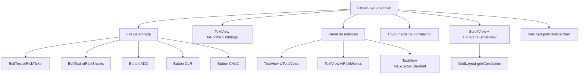

El XML está bien pensado:

1. arriba se colocan los controles,
2. en el centro se dejan los números más importantes,
3. debajo aparece la parte matricial,
4. y al final el gráfico circular.

### Imagen 

> Imagen: captura de la pestaña Risk con una cartera cargada.


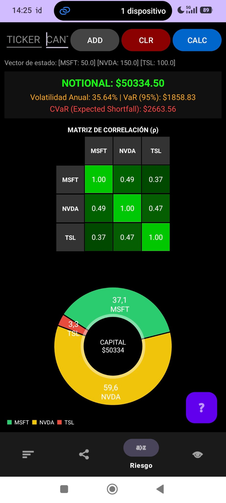


## 8. Pestaña Volatility: beta, ATR, percentil de volatilidad y RVOL

La pestaña `Volatility` mezcla dos enfoques:

1. riesgo de precio,
2. y facilidad de ejecución o liquidez relativa.

Es una pestaña muy útil porque no se queda en "se mueve mucho o poco". Va un paso más allá y pregunta: ¿se mueve mucho respecto a qué?, ¿y con qué volumen?

### Flujo general de la pestaña

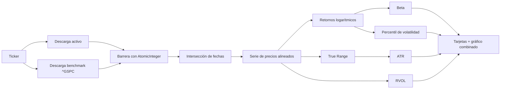

### Descarga paralela y sincronización

Aquí se hacen dos peticiones en paralelo:

1. una para el activo elegido,
2. otra para `^GSPC`, que se usa como benchmark del S&P 500.

Las respuestas se guardan en un `ConcurrentHashMap` y un `AtomicInteger` hace de barrera. Solo cuando ambas han llegado se dispara `procesarAlgebra(...)`.

Es una solución simple y correcta para sincronizar callbacks asíncronos.

### Alineación de fechas

Como en `Risk`, primero se calcula la intersección de fechas entre el activo y el benchmark. Si no hay al menos 30 observaciones comunes, la app aborta el análisis.

Eso evita sacar beta o volatilidades sobre muestras pobres.

### Retornos logarítmicos

El motor usa:

$$
r_t = \ln\left(\frac{P_t}{P_{t-1}}\right)
$$

La función `calculateLogReturns(...)` devuelve la serie de retornos del activo y del benchmark.

### Beta respecto al mercado

La beta se calcula como:

$$
\beta = \frac{\text{Cov}(r_a, r_m)}{\text{Var}(r_m)}
$$

donde:

1. $r_a$ son los retornos del activo,
2. $r_m$ son los retornos del mercado.

Interpretación:

1. $\beta > 1$: el activo amplifica al mercado.
2. $\beta < 1$: el activo es más defensivo.
3. $\beta \approx 0$: el activo está muy desacoplado.

### True Range y ATR

El rango verdadero diario es:

$$
TR_t = \max\left(H_t - L_t,\ |H_t - C_{t-1}|,\ |L_t - C_{t-1}|\right)
$$

Esto es mejor que usar solo $H_t - L_t$, porque incorpora gaps de apertura.

En el motor, el ATR que se muestra como escalar se calcula como media simple de los últimos $n$ valores de `TR`, con $n = 14$:

$$
ATR_t^{(14)} = \frac{1}{14}\sum_{k=0}^{13} TR_{t-k}
$$

Importante: en esta implementación el ATR es una **SMA de true ranges**, no el suavizado clásico de Wilder.

### RVOL o volumen relativo

La app calcula:

$$
RVOL_t = \frac{V_t}{\frac{1}{n}\sum_{k=1}^{n}V_{t-k}}
$$

con $n = 20$.

Es decir, compara el volumen actual con la media reciente de volumen. Si el resultado es muy superior a 1, el movimiento actual está ocurriendo con más participación que la habitual.

### Volatilidad anualizada

La desviación típica anualizada de una ventana de retornos se calcula como:

$$
\hat{\sigma}_{ann} = \sqrt{\frac{1}{m-1}\sum_{t=1}^{m}(r_t - \bar{r})^2}\cdot\sqrt{252}
$$

Esto aparece dentro del cálculo del percentil de volatilidad.

### Percentil de volatilidad

La función `calculateVolatilityPercentile(...)` toma ventanas de 20 días a lo largo del histórico. Para cada ventana calcula su sigma anualizada y compara la sigma actual con todas las anteriores.

Si llamamos $\sigma_1, \sigma_2, \dots, \sigma_K$ a esas volatilidades históricas y $\sigma_{act}$ a la última:

$$
\text{PctVol} = \frac{1}{K}\sum_{k=1}^{K}\mathbf{1}_{\{\sigma_k < \sigma_{act}\}}
$$

Ese resultado se multiplica por 100 para mostrarlo como porcentaje.

Conviene explicarlo bien: esto no es volatilidad implícita de opciones. Es un **percentil de volatilidad histórica realizada**.

### Qué muestra visualmente el gráfico

La visualización se hace con un `CombinedChart`:

1. unas barras de fondo enseñan el `True Range`,
2. otra capa de barras enseña volumen,
3. una línea superpuesta enseña el ATR rodante.

Además:

1. el eje izquierdo se reserva al rango/ATR,
2. el eje derecho se reserva al volumen,
3. el zoom inicial se centra en los últimos 60 días.

Es una buena forma de juntar ruido diario, volatilidad media y liquidez en un solo panel.

### Estructura de `fragment_volatility.xml`

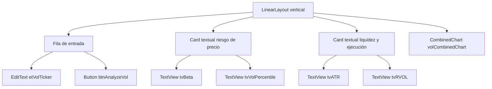

La organización aquí es muy agradecida:

1. primero los inputs,
2. luego las dos tarjetas de lectura rápida,
3. y abajo el gráfico grande.

### Imagen 

> Imagen: captura de la pestaña Volatility con un ticker analizado.


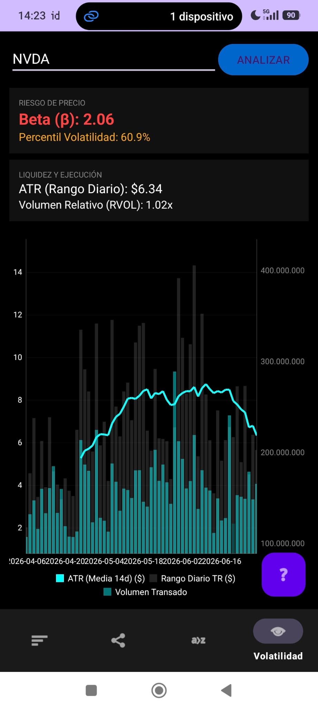


## 9. Cómo están programados los XML y la interfaz

Aunque ya he ido explicando cada pantalla por separado, aquí conviene dejar una visión común. Así la parte visual de la app queda mejor documentada.

### Flujo general entre XML y Java

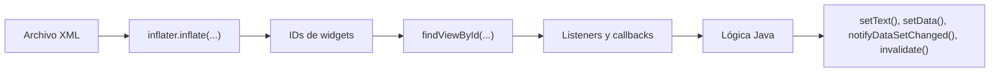

### Patrón visual que se repite

En casi toda la app se repite la misma receta:

1. `LinearLayout` vertical como contenedor principal.
2. Fondo oscuro manual.
3. `EditText` y `Button` arriba para interactuar.
4. `TextView` para métricas rápidas.
5. Un gráfico grande como pieza principal.

Es una interfaz muy de panel cuantitativo. No es una app decorativa. Va directa a la información.

### Decisiones visuales que merece la pena contar

1. El proyecto usa `Theme.Material3.DayNight.NoActionBar`, pero gran parte del estilo está definido de forma local con colores hardcodeados.
2. Se usan muchos negros y grises oscuros para que los gráficos resalten.
3. Los colores semánticos ayudan a leer rápido: verde para mejora, rojo para riesgo, cian y amarillo para curvas y medias.
4. `layout_weight` se usa mucho para repartir altura en los gráficos.
5. `ScrollView`, `HorizontalScrollView` y `GridLayout` permiten meter una matriz de correlación sin romper la pantalla.

### La biblioteca o glosario también forma parte de la UI

No conviene olvidarla, porque es una de las partes más pedagógicas de la app.

`GlossaryBottomSheet` hace esto:

1. abre una hoja inferior modal,
2. muestra un buscador,
3. pinta términos con `RecyclerView`,
4. permite filtrar en tiempo real con `TextWatcher`,
5. y desde el botón inferior lanza la IA.

### Esquema del glosario

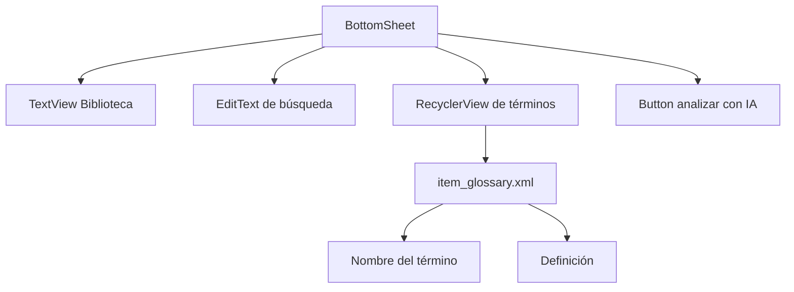

### Imagen sugerida

> Imagen pendiente: captura de la biblioteca con búsqueda y varios términos.


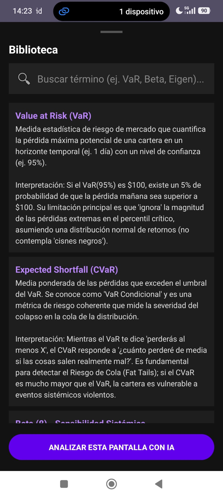


## 10. Detalles importantes de la app que también merece la pena explicar

Aquí dejo varias observaciones que quizá no son el centro de la app, pero sí ayudan a presentarla con honestidad y con rigor.

### 10.1. La fuente de Yahoo Finance es práctica, pero no oficial

`MarketRepository` usa un endpoint público de Yahoo Finance. Funciona, pero no ofrece el mismo contrato que una API oficial con documentación estable y SLA.


### 10.2. El módulo macro tiene el año 2026 fijado en la URL

En `TreasuryApi`, la ruta del CSV incorpora explícitamente `2026`.

Eso significa que el código actual está atado a ese año:

1. mientras estemos consultando datos de 2026, funciona,
2. cuando cambie el año, habrá que adaptar la URL,
3. o generalizar la construcción del endpoint.

Es un detalle técnico pequeño, pero importante.

### 10.3. La clave de Gemini está embebida en el código

`LlmRepository` lleva la API key dentro del propio archivo Java. Se debe 
Lo correcto en un entorno real sería:
cambiar cada uno a su clave personal

### 10.4. La matemática está desacoplada del framework Android

Esto es una fortaleza real del proyecto.

Las clases:

1. `SimpleMovingAverage`
2. `OscillatorEngine`
3. `FpcaEngine`
4. `RiskEngine`
5. `VolatilityEngine`

se pueden leer y discutir casi como si fueran parte de una librería matemática independiente.

### 10.5. La IA no inventa los datos de la pantalla

Gemini no descarga series ni recalcula indicadores. Solo recibe un prompt construido a partir de datos que la app ya ha calculado. Eso es importante porque reduce el riesgo de que la parte generativa suplante a la parte cuantitativa.

Dicho de otra forma: primero hay cálculo, luego interpretación.

## 11. Referencias e inspiración técnica

Estas son las referencias más útiles para justificar la arquitectura y las librerías empleadas.

### Android y arquitectura de interfaz

1. Android Fragments: [https://developer.android.com/guide/fragments](https://developer.android.com/guide/fragments)
2. Fragment transactions: [https://developer.android.com/guide/fragments/transactions](https://developer.android.com/guide/fragments/transactions)
3. Layouts XML en Android: [https://developer.android.com/guide/topics/ui/declaring-layout](https://developer.android.com/guide/topics/ui/declaring-layout)
4. RecyclerView: [https://developer.android.com/develop/ui/views/layout/recyclerview](https://developer.android.com/develop/ui/views/layout/recyclerview)
5. Bottom sheets: [https://developer.android.com/develop/ui/views/components/bottomsheet](https://developer.android.com/develop/ui/views/components/bottomsheet)
6. Dialogs y AlertDialog: [https://developer.android.com/develop/ui/views/components/dialogs](https://developer.android.com/develop/ui/views/components/dialogs)
7. Room Persistence Library: [https://developer.android.com/training/data-storage/room](https://developer.android.com/training/data-storage/room)

### Librerías externas usadas en la app

1. Retrofit: [https://square.github.io/retrofit/](https://square.github.io/retrofit/)
2. MPAndroidChart: [https://github.com/PhilJay/MPAndroidChart](https://github.com/PhilJay/MPAndroidChart)
3. Apache Commons Math: [https://commons.apache.org/proper/commons-math/userguide/](https://commons.apache.org/proper/commons-math/userguide/)
4. Gemini API, generación de texto: [https://ai.google.dev/gemini-api/docs/text-generation](https://ai.google.dev/gemini-api/docs/text-generation)

### Fuentes de datos y referencias financieras

1. U.S. Treasury, Daily Treasury Par Yield Curve Rates: [https://home.treasury.gov/resource-center/data-chart-center/interest-rates/daily-treasury-rates.csv/2026/all?type=daily_treasury_yield_curve&field_tdr_date_value=2026&page&_format=csv](https://home.treasury.gov/resource-center/data-chart-center/interest-rates/daily-treasury-rates.csv/2026/all?type=daily_treasury_yield_curve&field_tdr_date_value=2026&page&_format=csv)
2. FRED, spread 10Y-2Y (`T10Y2Y`): [https://fred.stlouisfed.org/series/T10Y2Y](https://fred.stlouisfed.org/series/T10Y2Y)

### Referencias teóricas para la parte de curva de tipos

1. Diebold, Rudebusch y Aruoba, *The Macroeconomy and the Yield Curve: A Dynamic Latent Factor Approach*: [https://www.nber.org/papers/w10616](https://www.nber.org/papers/w10616)
2. Giese, *Level, Slope, Curvature: Characterising the Yield Curve in a Cointegrated VAR Model*: [https://hdl.handle.net/10419/27512](https://hdl.handle.net/10419/27512)

## 12. Cierre
Quanttrack no intenta hacerlo todo. Y eso, en este caso, es bueno.

La aplicación tiene una idea clara: tomar series de mercado, resumirlas con herramientas cuantitativas conocidas y convertirlas en una interfaz que cualquiera del equipo pueda leer sin perderse.


